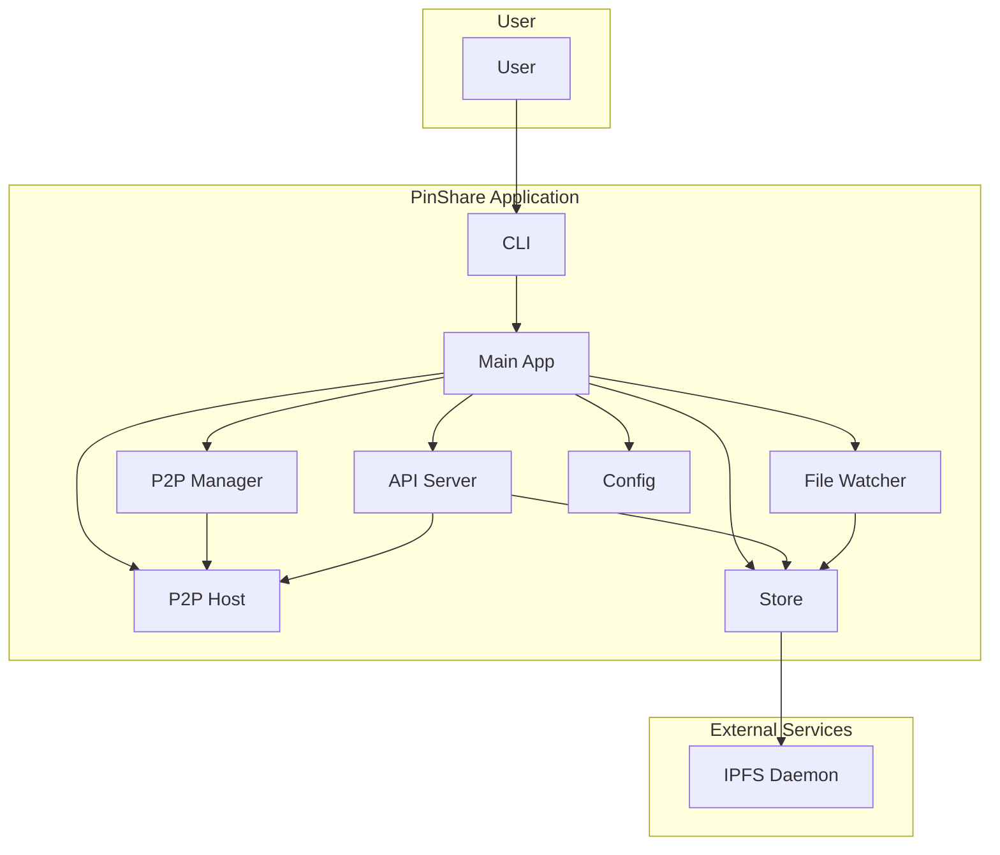

```mermaid
graph TD
    subgraph User
        A[User]
    end

    subgraph PinShare Application
        B[CLI]
        C[Main App]
        D[API Server]
        E[P2P Host]
        F[P2P Manager]
        G[Store]
        H[File Watcher]
        I[Config]
    end

    subgraph External Services
        J[IPFS Daemon]
    end

    A --> B
    B --> C
    C --> D
    C --> E
    C --> F
    C --> G
    C --> H
    C --> I
    F --> E
    D --> G
    D --> E
    H --> G
    G --> J
```
