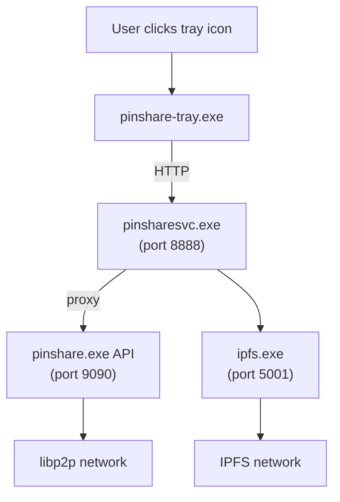

# PinShare Windows Architecture

This document describes the architecture of PinShare when deployed on Windows.

## Process Hierarchy

```
┌─────────────────────────────────────────────────────────────────────────────┐
│  pinshare-tray.exe (User Process)                                           │
│  ┌─────────────────────────────────────┐                                    │
│  │ • Runs in USER context              │                                    │
│  │   (per-user, after login)           │                                    │
│  │ • System tray icon for user         │                                    │
│  │   interaction                        │                                    │
│  │ • NOT managed by service            │                                    │
│  │   - completely independent          │                                    │
│  │ • Talks to service via HTTP APIs    │                                    │
│  └─────────────────────────────────────┘                                    │
└─────────────────────────────────────────────────────────────────────────────┘
        │
        │ HTTP API calls
        ▼
┌─────────────────────────────────────────────────────────────────────────────┐
│  Windows Service Manager (runs at system startup)                           │
│                          │                                                  │
│                          ▼                                                  │
│  ┌───────────────────────────────────────────────────────────────────────┐  │
│  │  pinsharesvc.exe (Windows Service)                                    │  │
│  │                                                                       │  │
│  │  • Runs as SYSTEM account (no user login required)                    │  │
│  │  • Manages child processes (keeps them alive)                         │  │
│  │  • Monitors health & auto-restarts crashed processes                  │  │
│  │                                                                       │  │
│  │  ┌─────────────────────────────┐   ┌─────────────────────────────┐   │  │
│  │  │  pinshare.exe               │   │  ipfs.exe                   │   │  │
│  │  │  (child process)            │   │  (child process)            │   │  │
│  │  │                             │   │                             │   │  │
│  │  │  • libp2p host              │   │  • IPFS daemon              │   │  │
│  │  │  • PubSub messaging         │──▶│  • Port 5001 (API)          │   │  │
│  │  │  • File watcher             │   │  • Port 4001 (swarm)        │   │  │
│  │  │  • API on port 9090         │   │  • Port 8080 (gw)           │   │  │
│  │  └─────────────────────────────┘   └─────────────────────────────┘   │  │
│  └───────────────────────────────────────────────────────────────────────┘  │
└─────────────────────────────────────────────────────────────────────────────┘
```

## Components

### pinsharesvc.exe (Windows Service Wrapper)

The main Windows service that orchestrates all PinShare components.

**Responsibilities:**
- Registers as a Windows Service ("PinShareService")
- Starts and monitors IPFS daemon
- Starts and monitors PinShare backend
- Health checking with automatic restart on failure
- Graceful shutdown of all components

**Source:** `cmd/pinsharesvc/`

### pinshare.exe (Main Daemon)

The core PinShare application with libp2p networking.

**Responsibilities:**
- libp2p host for P2P communication
- PubSub for metadata synchronization
- File watcher for upload folder
- REST API for external integrations
- Connects to IPFS daemon for storage

**Ports:**
- 9090: REST API
- 50001: libp2p P2P port

**Source:** `internal/` (main application code)

### ipfs.exe (IPFS Kubo Daemon)

Standard IPFS daemon for content-addressed storage.

**Ports:**
- 5001: IPFS API
- 4001: IPFS Swarm (P2P)
- 8080: IPFS Gateway

**Source:** Downloaded from https://dist.ipfs.tech/kubo/

### pinshare-tray.exe (System Tray Application)

User-facing system tray application for easy interaction.

**Responsibilities:**
- System tray icon with context menu
- Open web UI in browser
- Start/Stop/Restart service
- Show service status

**Note:** This runs independently of the service, launched via Windows Startup folder.

**Source:** `cmd/pinshare-tray/`

## Data Flow



## Installed Files

```
C:\Program Files\PinShare\
├── pinsharesvc.exe    # Windows service wrapper
├── pinshare.exe       # Main daemon (managed by service)
├── pinshare-tray.exe  # User tray app (independent)
├── ipfs.exe           # IPFS daemon (managed by service)
└── resources/         # Tray app resources
    └── icon.ico

C:\ProgramData\PinShare\
├── config.json        # Configuration file
├── ipfs\              # IPFS repository
│   ├── config
│   ├── datastore\
│   └── ...
├── pinshare\          # PinShare data
│   ├── identity.key   # libp2p identity
│   └── metadata.json  # File metadata store
├── upload\            # Watch folder for new files
├── cache\             # Downloaded/processed files
├── rejected\          # Files that failed security scan
└── logs\              # Log files
    ├── service.log
    ├── ipfs.log
    └── pinshare.log
```

## Configuration

Configuration is stored in `C:\ProgramData\PinShare\config.json`. See the README for available options.

## Service Management

### Install Service
```batch
pinsharesvc.exe install
```

### Uninstall Service
```batch
pinsharesvc.exe uninstall
```

### Start/Stop Service
```batch
pinsharesvc.exe start
pinsharesvc.exe stop
pinsharesvc.exe restart
```

### Debug Mode (Console)
```batch
pinsharesvc.exe debug
```

### Using Windows Service Manager
```batch
net start PinShareService
net stop PinShareService
sc query PinShareService
```

## Health Monitoring

The service includes a health checker that:
- Checks IPFS health every 30 seconds via `http://localhost:5001/api/v0/version`
- Checks PinShare health every 30 seconds via `http://localhost:9090/api/health`
- Automatically restarts failed components (up to 3 times)
- Logs all health events to Windows Event Log

## Security Capabilities

PinShare supports multiple security scanning backends:

| Capability | Description | Requirements |
|------------|-------------|--------------|
| 0 | No scanning (fails startup) | - |
| 1 | P2P-Sec service | Port 36939 running |
| 2 | VirusTotal API | VT_TOKEN env var |
| 3 | ClamAV | clamscan in PATH |
| 4 | VirusTotal via browser | Chromium installed |

Set `"skip_virus_total": true` in config.json to bypass all scanning (for testing).
